

  <h1>3DLIVUS: 3D LIVer UltraSound</h1>

<a href="https://scholar.google.com/citations?user=pPSHM1kAAAAJ&hl=en" target="_blank" rel="noopener noreferrer">
  Shuwei Xing, PhD;&nbsp; 
</a>

<a href="https://www.schulich.uwo.ca/medimaging//people/bios/faculty/derek_cool.html" target="_blank" rel="noopener noreferrer">
  Derek W. Cool, PhD, MD; &nbsp; 
</a> 

<a href="https://www.robarts.ca/research/scientists/fenster_aaron.html" target="_blank" rel="noopener noreferrer">
  Aaron Fenster, PhD
</a>

<a>
  Robarts Research Institute, Western University, Canada
</a>

## Introudction

  

Liver tumour ablation is a minimally invasive treatment for early-stage liver cancer, especially for patients who are ineligible for surgery. Ultrasound (US) is commonly used during procedures as it provides real-time imaging, is widely available, and doesn’t use radiation. Conventionally, doctors must interpret 2D images to locate tumours in a 3D space. This process requires extensive experience and training to perform reliably. Additionally, identifying tumours using US can be challenging, especially when the tumour is confused with non-cancerous nodules or in a hard-to-reach location. These challenges limit the use of ablation procedures in clinical practice. This project aims to investigate how 3D US can improve and facilitate percutaneous thermal liver tumour ablation, with potential translation to other oncological procedures such as renal tumour ablation.

<table align="center" border="0" cellspacing="0" cellpadding="0" style="border:none !important; border-collapse:collapse !important; border-spacing:0 !important; border-top:0 !important; border-bottom:0 !important;">
  <tr>
    <td align="center" width="50%" style="border:none !important; padding:0 !important;">
      <a href="https://www.youtube.com/watch?v=rgaihhQIr80" target="_blank" rel="noopener noreferrer">
        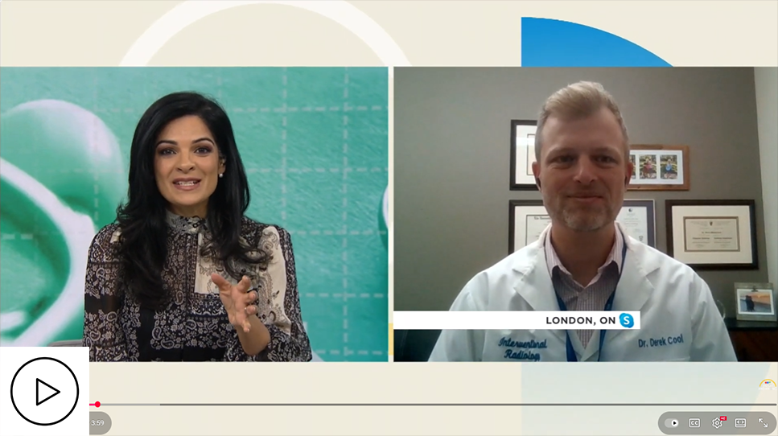
      </a>
       
      <a>🎬 3DLIVUS featured on CTV News (Jan 27, 2023)</a>
    </td>
    <td align="center" width="50%" style="border:none !important; padding:0 !important;">
      <a href="https://youtu.be/hxs5y-deY70" target="_blank" rel="noopener noreferrer">
        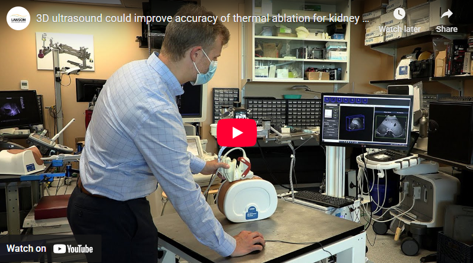
      </a>
       
      <a>🎬 Demonstration by Schulich School of Medicine & Dentistry </a>
    </td>
  </tr>
</table>

## Project 1: 3DLIVUS System

  
  
  

The <strong>3DLIVUS</strong> system comprises <strong>a counterbalanced arm</strong> with encoders and electromechanical locks, <strong>a motor-driven 3D US scanner</strong> mounted at the arm end, and <strong>a workstation</strong> with customized control software (see Figure 1). It interfaces with any commercial US machine and uses joint encoders in the mechatronic arm for pose tracking, eliminating susceptibility to clinical environmental factors. Operating passively, it allows users to freely maneuver the US transducer while also supporting automated motion along predefined trajectories—60° tilting around the X-axis, 60 mm translation along the Z-axis, and rotation–translation hybrid.

Note: The architecture of our robotic/mechatronic arm differs significantly from conventional industrial robots such as the <a href="https://www.kuka.com/en-ca/products/robotics-systems/industrial-robots/lbr-iiwa" target="_blank" rel="noopener noreferrer">KUKA LBR iiwa</a>. The arm was purposefully designed to accommodate the workflow of liver tumour ablation procedures. For instance, the 3DLIVUS system may need to be positioned on the side opposite the target liver, requiring an extended reach without interfering with the clinical setup. Adapting commercially available robotic arms to such constrained environments remains challenging.

  
   
  <a>Figure 1. (a) Overview of the 3DLIVUS system; (b) 3D US scanning mode.</a>

 

  Figure 2 illustrates the proposed framework for integrating 3D US into the standard clinical ablation workflow. This framework enhances the capabilities of 3D US imaging for improving percutaneous tumour ablation and demonstrates its potential to expand the therapeutic role of 3D US in clinical interventions. Specifically, the workflow is augmented with intra-procedural tumour coverage assessment (Project 2), tumour identification (Project 3), and multimodal visualization with instrument tracking (Project 4).

  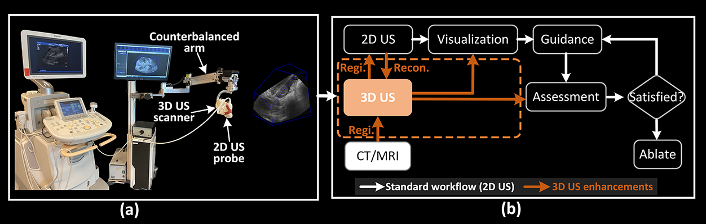
   
  <a>Figure 2. Framework for 3D US integration into conventional 2D US guidance. (a) 3DLIVUS system; (b) intra-procedural guidance. Note: the role of 3D US is highlighted in a brown block. (Regi: Registration, Recon: 3D US reconstruction)</a>

## 3D US Acquisition & Clinical Trial
### How does 3DLIVUS acquire images during the procedure?

The 3D US acquisition process is fully automated. During the procedure, the physician or sonographer positions the conventional US probe over the target area, after which the 3D US scanner automatically drives the probe to capture a sequence of 2D images for 3D reconstruction. The entire process, including reconstruction, is completed within approximately 7–12 seconds. 

  
   
  <a>🎬 Watch the 3DLIVUS system demonstration on image acquisition.</a>

### Patient trial at Victoria Hospital (London, Ontario, Canada)

  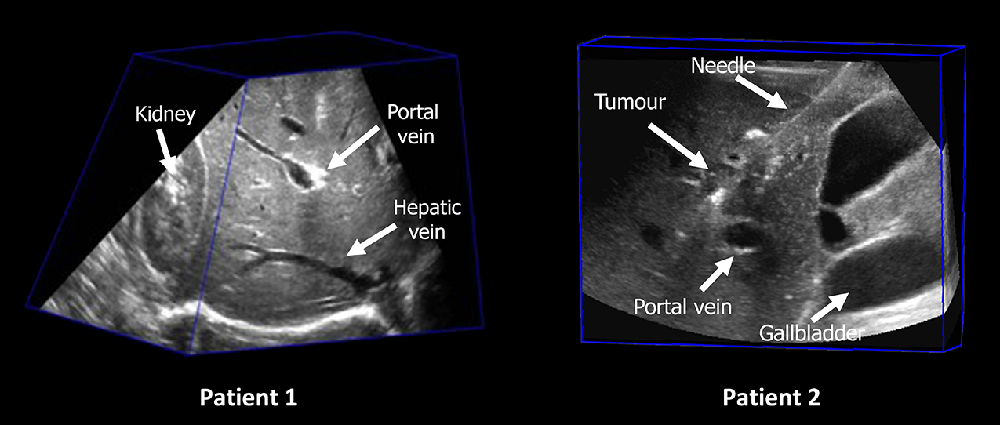
   
  <a> Figure 3. 3D US examples of two patients. </a>

 

Figure 3 presents a patient’s acquired 3D US images, demonstrating the 3DLIVUS system in action. Relevant anatomical structures—including hepatic vessels, kidney, gallbladder, tumour, and inserted needles—are clearly visualized in the reconstructed volume. This achievement provides a critical foundation for subsequent investigations in percutaneous liver tumour ablation, including intra-procedural tumour coverage assessment, enhanced tumour identification, and needle tracking (see details below).

## Project 2: Intra-procedural Tumour Coverage Assessment

### Why improve intra-procedural tumour coverage assessment?

In conventional US-guided ablation (left figure), the physician typically places a few landmarks on in-plane 2D US images to estimate the required ablation zone. Although a 5–10 mm safety margin is commonly applied in clinical practice to reduce the risk of residual tumours, this approach may still fail to ensure complete tumour coverage. Moreover, to maintain procedural safety, the physician must carefully review multiple US views to avoid ablating critical structures such as the colon (right figure).

<table align="center" border="0" cellspacing="0" cellpadding="0" style="border:none !important; border-collapse:collapse !important; border-spacing:0 !important; border-top:0 !important; border-bottom:0 !important;">
  <tr>
    <td align="center" width="50%" style="border:none !important; padding:0 !important;">
        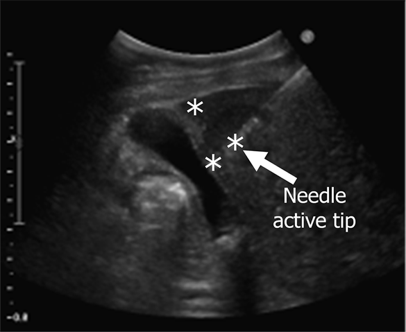
      <!--   -->
      <a>Tumour coverage assessment on 2D US</a>
    </td>
    <td align="center" width="50%" style="border:none !important; padding:0 !important;">
        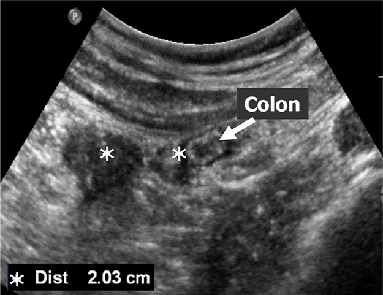
      <!--   -->
      <a>Tumour coverage assessment with surrounding structures </a>
    </td>
  </tr>
</table>

### 3D US-based Tumour Coverage Evaluation

To evaluate the proposed approach, we conducted a clinical trial between 2021 and 2022, involving 12 patients—8 treated with RFA and 4 with MWA. As shown in this figure, both the tumour and needle were manually segmented in the 3D US images, and the ablation zone was estimated based on the manufacturer’s specifications. The surface distances between the tumour and the estimated ablation zone were then calculated and validated against follow-up CT/MRI outcomes. Using conventional 2D US, tumour coverage was correctly predicted in 9 of 12 cases, whereas our 3D US approach achieved 11 of 12 correct predictions. The remaining case discrepancy was attributed to new disease progression rather than limitations of the 3D US-based estimation. These findings demonstrate that the 3D US approach provides reliable and clinically valuable information for tumour coverage assessment during ablation procedures.

 

  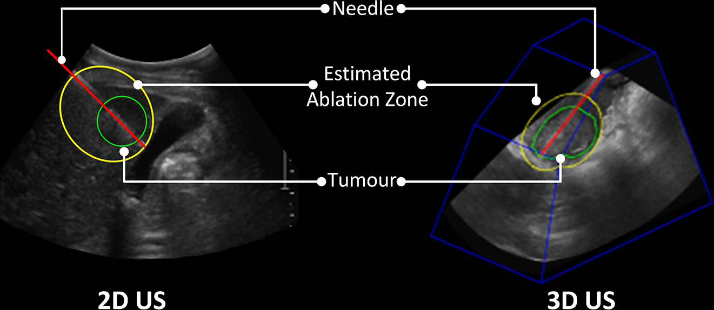
   
  <a>Figure 3. Comparison of tumour coverage evaluation on 2D and 3D US.</a>

### 3D US-based Needle Adjustment (If required)

The next question is whether 3D US can be used intra-procedurally to optimize untreated tumour regions. To explore this, we developed a novel margin uniformity approach for needle position optimization. The top row illustrates various clinical scenarios that may occur during ablation, while the second row presents corresponding 2D plots generated by our method, indicating the necessary adjustments to improve needle placement.

  
   
  <a>Figure. 3D US-based needle adjustment.</a>

 

Here is a patient case that requires needle adjustment for complete tumour coverage.

  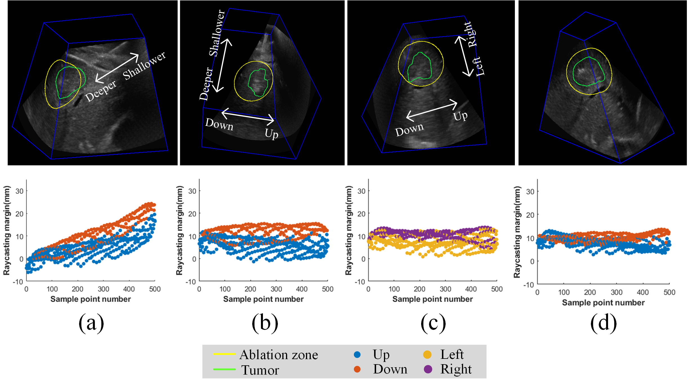
   
  <a>Figure. 3D US-based needle adjustment case on a patient.</a>

## Project 3: Tumour Identification

### Why improve tumour identification?

  In conventional US guidance, some liver tumours have low conspicuity or are nearly undetectable when imaging small lesions or tumours located in challenging regions, such as the liver dome (see Fig. X left). In addition, tumour mimics, such as regenerative nodules and prior ablation sites, may cause further confusion, making it even more challenging for physicians to accurately identify the tumour, as shown in Fig. right. 

 
<table align="center" border="0" cellspacing="0" cellpadding="0" style="border:none !important; border-collapse:collapse !important; border-spacing:0 !important; border-top:0 !important; border-bottom:0 !important;">
  <tr>
    <td align="center" width="50%" style="border:none !important; padding:0 !important;">
        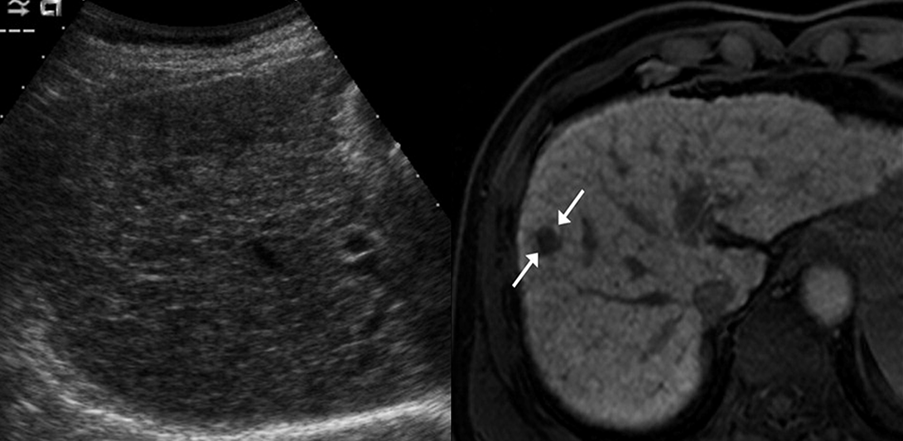
       
      <a> Left: invisible tumour in US; Right: visible tumour in MRI</a>
    </td>
    <td align="center" width="50%" style="border:none !important; padding:0 !important;">
        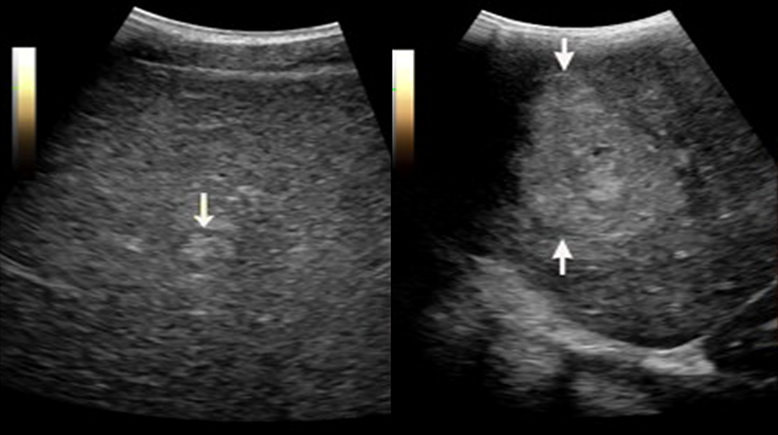
       
      <a> Left: benign regenerative nodule; Right: malignant HCC</a>
    </td>
  </tr>
</table>

### Our proposed 2D US-to-CT/MRI registration solution

The idea of our proposed method is to divide the direct 2D US-to-CT or MRI registration into two components, which are 3D US-to-CT or MRI registration and 2D US-to-3D US registration. This decomposition strategy could significantly reduce the computational burden for registration algorithms. In addition, the introduction of 3D US images does not increase the clinical workload complexity. The 3D US image acquisition only requires 7s-12s for a single image, and this image can also improve intra-procedure tumour coverage, as demonstrated previously. For this project, we developed a series of registration methods, including <a href="https://github.com/Xingorno/3DUS-CT-or-MRI-Rigid-Registration" target="_blank" rel= "noopener noreferrer">rigid 3D US-to-CT/MRI registration</a>, <a href="https://github.com/Xingorno/TPS-based-Interactive-Deformable-Registration" target="_blank" rel= "noopener noreferrer">deformable 3D US-to-CT/MRI registration</a> and <a href="https://github.com/Xingorno/DeepRegS2V" target="_blank" rel= "noopener noreferrer">rigid 2D-to-3D US registration</a>.

 

  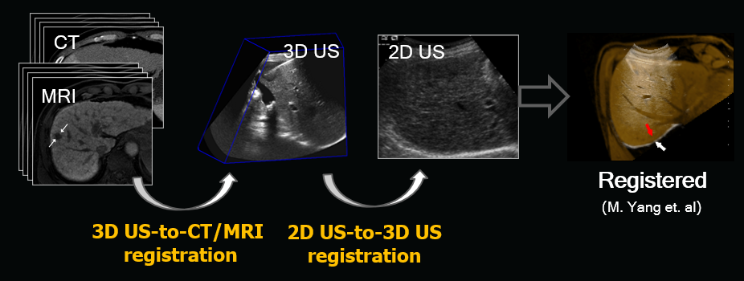
   
  <a>Figure. Registration overview of 2D US-to-CT/MRI images</a>

### Clinical results
Here are some results on humans.

  <a href="https://www.youtube.com/watch?v=88EfB2hzf-8" target="_blank" rel="noopener noreferrer">
    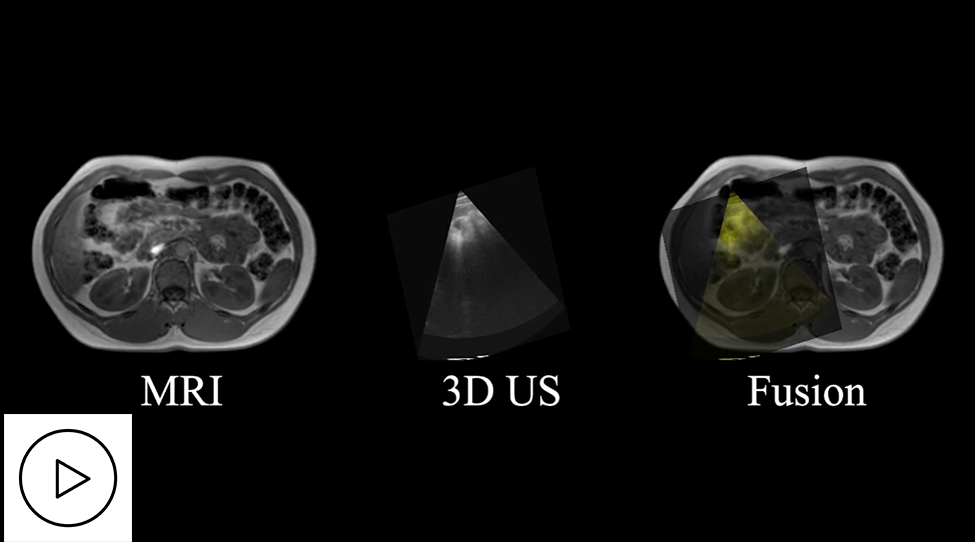
  </a>
   
  <a>🎬 3DLIVUS registration: 3D US-to-CT/MRI.</a>

 

  <a href="https://www.youtube.com/watch?v=BHfTiwmbq2c" target="_blank" rel="noopener noreferrer">
    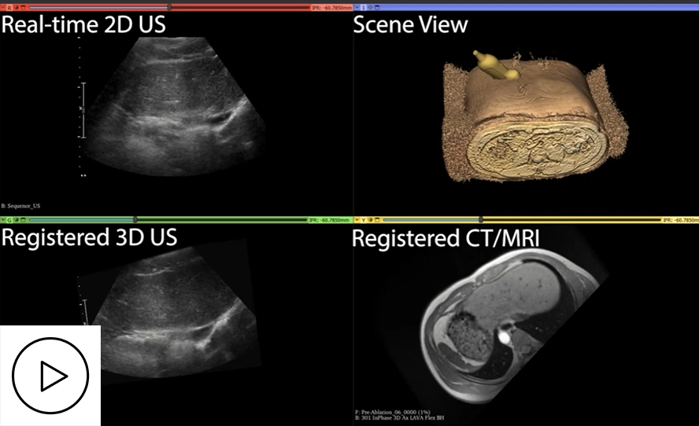
  </a>
   
  <a>🎬 3DLIVUS registration: 2D US-to-CT/MRI.</a>

## Project 4: Needle Identification (Ongoing...)

### Why improve needle tracking?

  Needle’s active tip determines the location of the generated ablation zone, directly impacting the tumour coverage and treatment effectiveness. However, accurate needle identification remains a challenge due to several factors: (1) Due to the in-plane insertion requirement, the needle often veers away from the imaging plane. (2) And the needle often shows poor image quality, especially when inserted at a steep angle or at greater depths. (3) In addition, needle mimics such as the boundary of the gallbladder can resemble the needle, further complicating identification and increasing the risk of misinterpretation. These challenges highlight the need for improved needle tracking methods to enhance accuracy, confidence, and treatment success in ultrasound-guided ablation, as shown in the video below.

 

  
   
  <a>🎬 3DLIVUS tracking: Needle tracking.</a>

 

### What are we doing?

This project is still ongoing. The patient dataset has already been collected and annotated. 
<strong>The update is coming soon!</strong>

