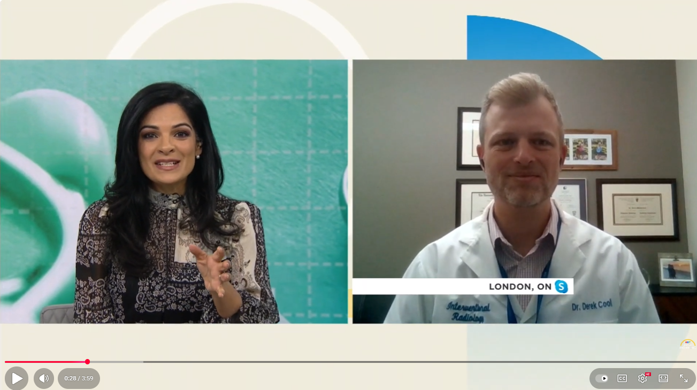
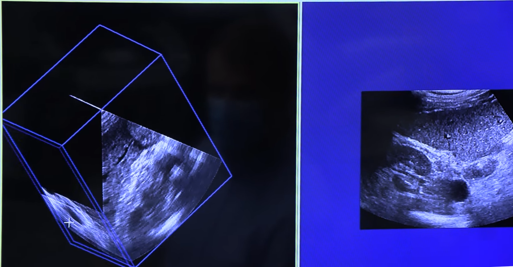
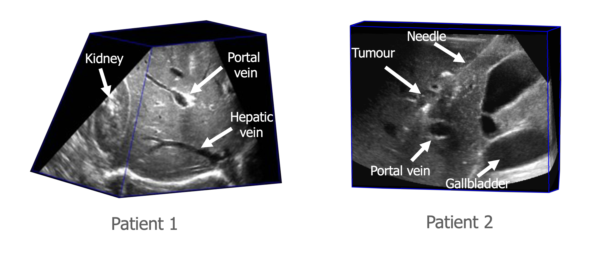

<!-- <html> -->
<!-- <head> -->

<!-- </head> -->
<!-- </html> -->

  <h1>3DLIVUS: 3D LIVer UltraSound</h1>

<a href="https://www.robarts.ca/peterslab/" target="_blank" rel="noopener noreferrer">
  Fenster Lab, Robarts Research Institute, Western University
</a>
 
<a href="https://www.robarts.ca/peterslab/" target="_blank" rel="noopener noreferrer">
  VASST Lab, Robarts Research Institute, Western University
</a>

## Introudction
This project aims to investigate how 3D ultrasound can improve and facilitate percutaneous thermal liver tumour ablations. It also shows the potentials to translate to other clinical oncological applications, such as renal tumour ablation.

  

<!-- 

  
   
  <em>🎬 Watch the 3DLIVUS system demonstration featured on CTV News (Jan 27, 2023).</em>

 -->

<!-- 

  
   
  <em>🎬 Watch the 3DLIVUS system demonstration featured on Schulich School of Medicine & Medicine (Jan., 2023).</em>

 -->

<table align="center">
  <tr>
    <td align="center" width="50%">
      
       
      <em>🎬 3DLIVUS featured on CTV News (Jan 27, 2023)</em>
    </td>
    <td align="center" width="50%">
      
       
      <em>🎬 Demonstration by Schulich School of Medicine & Dentistry </em>
    </td>
  </tr>
</table>

## Project 1: 3DLIVUS System

  
  

The <strong>3DLIVUS</strong> system integrates <strong>a counterbalanced arm</strong> with encoders and electromechanical locks, <strong>a motor-driven 3D US scanner</strong> mounted at the arm end, and <strong>a workstation</strong> with customized software. It interfaces with any commercial US machine and uses joint encoders in the mechatronic arm for pose tracking, eliminating susceptibility to clinical environmental factors. Operating passively, it allows users to freely maneuver the US transducer while also supporting automated motion along predefined trajectories—60° tilting around the X-axis, 60 mm translation along the Z-axis, and rotation–translation hybrid.

<em>Note: the architecture of our robotic/mechatronic arm is apparently different from the widely used industrial arm, such as <a href="https://www.kuka.com/en-ca/products/robotics-systems/industrial-robots/lbr-iiwa" target="_blank" rel="noopener noreferrer"><strong>LBR iiwa, KUKA</strong></a>. We designed this arm on purpose, which is to better accommodate with liver tumour ablation procedures. For instance, the 3DLIVUS might need to be placed on the opposite side of the patient liver. In this setting, the arm should be long enough to easily reach to the target without bothering the standard workflow. Using the commerically available robot is challenging to adapt this environment.</em>

  
   
  <em>Figure 1. (a) Overview of the 3DLIVUS system; (b) 3D US scanning mode.</em>

 

For the development of 3DLIVUS system, not only the hardware design and maching, such as the counterbalanced arm and 3D US scanner, we have also developed a robust and efficient arm calibration approach. The detailed work can be accessed through the shared badge link.  

## Project 2: 3D US Acquisition & Clinical Trial
### How does 3DLIVUS acquire images during the procedure?

  The 3D US acquisition is fully automatic. During procedure, the physician/sonographer firstly needs to place the convential US probe on the target area of the patient, then the probe can be automatically driven by the 3D US scanner to acquire a sequence of 2D US images, which is used for 3D US reconstruction. The whole process (including reconstruction) takes around 7-12 seconds.

  
   
  <em>🎬 Watch the 3DLIVUS system demonstration on image acquisition.</em>

### Patient trial at Victoria Hospital (London, Ontario, Canada)

  

 

  This figure shows the acquired patient's 3D US images, demonstrating the 3DLIVUS system in action. The related structures, including hepatic vessels, kidney, gallbladder and tumour, and inserted needles can be well captured and visualized in our 3D US images. This achievement served as the critical foundation for investigating the downstream tasks related to percutaneous liver tumour ablation, including intra-procedural tumour coverage assessment, improving tumour identification and needle tracking, please see details in below.

## Project 3: Intra-procedural Tumour Coverage Assessment

## Project 4: Tumour Identification

## Project 5: Needle Identification (Ongoing...)
